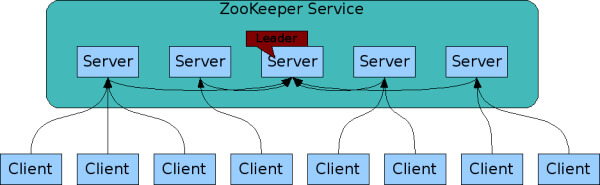
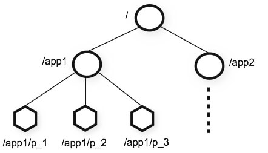
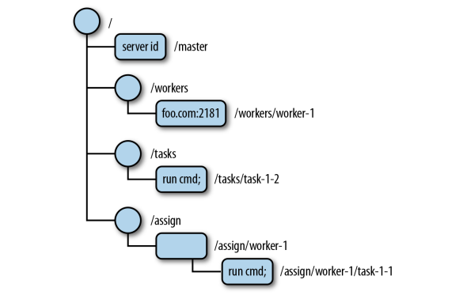
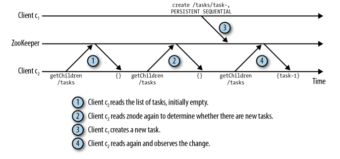
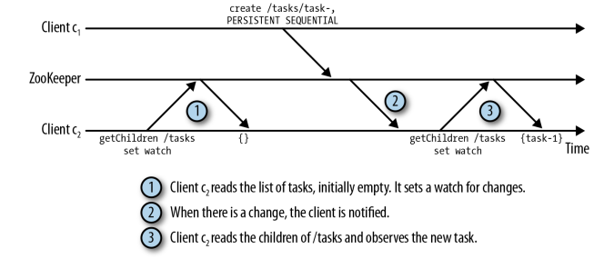
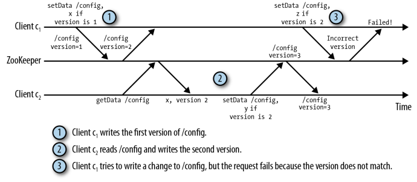

## ZooKeeper架构概述

ZooKeeper虽然是分布式系统的协调服务，但它本身就是一个分布式应用程序。ZooKeeper遵循` client-server `模型，其中`client`是使用`server`的节点（即机器），`server`是提供服务的节点。应用程序通过`client library`调用ZooKeeper。`client`负责与ZooKeeper 服务器的交互。下图显示了客户端和服务器之间的关系。每个客户端都可以与任何ZooKeeper节点进行通信。




ZooKeeper服务器以两种模式运行： **`standalone` 和 `quorum`**。

- `standalone`：只有一个服务器，并且没有复制ZooKeeper状态。
- `quorum`: 一组ZooKeeper服务器（我们称之为ZooKeeper ensemble）复制状态，它们一起服务于客户端请求。

在任何给定时间，一个ZooKeeper客户端连接到一个ZooKeeper服务器。每个ZooKeeper服务器可以同时处理大量客户端连接。每个客户端定期向它连接的ZooKeeper服务器发送ping命令，让它知道它处于活动状态并已连接。ZooKeeper服务器响应ping的确认，表明服务器也处于活动状态。当客户端在指定时间内没有收到来自服务器的确认时，客户端连接到集合中的另一个服务器，客户端会话透明地转移到新的ZooKeeper服务器。


## ZooKeeper的设计目标

- 必须能够容忍失败
- 必须能够从相关的可恢复故障中恢复（停电）
- 保持高一致性
- 能够简单部署
- 快速（高吞吐量，低延迟）

### 数据模型和ZooKeeper的分层命名空间




ZooKeeper提供的名称空间非常类似于标准文件系统。名称是由斜杠（/）分隔的路径元素序列。ZooKeeper名称空间中的每个节点都由路径标识。与标准文件系统不同，ZooKeeper命名空间中的每个节点都可以包含与之关联的数据以及子项。这就像拥有一个允许文件也是目录的文件系统。（ZooKeeper旨在存储协调数据：状态信息，配置，位置信息等，因此存储在每个节点的数据通常很小，在字节到千字节范围内。）

`Znodes`维护一个`stat`结构，包括数据更改，ACL更改和时间戳的版本号，以允许缓存验证和协调更新。每次znode的数据更改时，版本号都会增加。例如，每当客户端检索数据时，它也接收数据的版本。

存储在命名空间中每个znode的数据以原子方式读取和写入。读取获取与znode关联的所有数据字节，写入替换所有数据。每个节点都有一个访问控制列表（ACL），限制谁可以做什么。

znode层次结构存储在每个ZooKeeper服务器的内存中。这允许对来自客户端的读取进行可伸缩和快速响应。每个ZooKeeper服务器还在磁盘上维护一个事务日志，记录所有写入请求。此事务日志也是ZooKeeper中性能最关键的部分，因为ZooKeeper服务器必须在事务返回成功响应之前将事务同步到磁盘。可以存储在znode中的默认**最大数据大小为1 MB**。因此，**即使ZooKeeper呈现类似文件系统的层次结构，也不应将其用作通用文件系统**。相反，它应该仅用作为分布式应用程序提供可靠性，可用性和协调所需的少量数据的存储机制。

## 架构实例

我们将围绕一个例子去讲述概念并实践。这个例子是：Master-Worker分布式架构。 
架构图如下：


Master进程的职责是跟踪Worker和任务，并将任务分派给Worker。为了实现这个Master-Worker系统，我们必须解决这三个关键问题：

- Master故障
  如果master故障并且变得不可用，系统就不能分配新任务或重新分配失败的任务。

- Woker故障
  如果worker故障，则分配给它的任务则完成不了。

- 通信失败
  如果master和worker不能交换信息，则worker可能无法获取分派给它的任务。

为了解决上述问题，这个系统必须有以下功能：

- 能在一个master挂掉之后，重新选择一个新的master；
- 判断那些woker是可用的；
- 当worker与master因为网络分区失去与master连接时能够重新分派任务；
- 当一个节点获得锁之后发生网络分区或挂掉时，需让这个锁失效。

> 重新分配任务有以下情况：如果任务可重复执行，则可以无需任何校验的把这任务重新分派。但如果这个任务是不能重复执行的，则需要协调多个worker执行任务的情况。

## znode

ZooKeeper并没有直接提供上述的功能，而是提供一个跟文件系统很像的API。这个被组织称树结构，每个结点都存储很小的数据的结点（不超过1M），被称为znode。如下图，根结点包含4个结点，其中3个又是分支结点，拥有叶子节点。而叶子结点就包含数据。



结点不存在在znode里也蕴含信息。例如在这个Master-Worker例子里，如果master结点不存在，则表明master还没选出来。另外根据上图，我们可以看出/workers结点是当前系统中所有可用的woker的父节点。foo.com:2181是worker的信息。如果woker不可用了，就应该把对应的结点从/worers上删除。 
/tasks结点是所有任务的父结点，其子结点是已经被创建的任务，且等待被执行。Master-Worker例子里，客户端就可以在/tasks下创建一个结点来代表一个新任务，并且等待该任务的状态。 
最后/assign结点的子结点是所有已经被分派给worker的任务。

znode可以有也可以没有数据。如果有数据，数据类型必须是字节数据（Byte Array）。字节数组的含义解释就需要各自应用决定，ZooKeeper没有提供解析这字节数组的功能。

ZooKeeper的命令行提供了一下API：

- 创建一个znode结点名为/path，包含数据data

```
create /path data
```

- 删除znode结点/path

```
delete /path
```

- 检查是否有/path结点

```
exists /path
```

- 设置/path结点的数据

```
setData /path data
```

- 获取/path结点数据

```
getData /path
```

- 获取/path结点的子结点列表

```
getChildren /path
```


## znode的模式

在创建znode结点时，我们可以指定模式（mode），不同模式决定znode结点的不同行为：

### 永久（Persistent）和临时（Ephemeral）znode结点

znode结点只能是永久结点或者是临时结点。永久结点/path只能被delete命令删除。而临时结点，在创建该结点的客户端故障了或失去与ZooKeeper失去连接时，这个结点会被删除。 
在Master-Worker例子里，我们需要维护任务的分派情况，哪怕master故障了。 

临时znode结点传递着这样的信息：结点的创建者的session有效，则结点的应用才能存在。例如，master的结点在Master-Worker例子里就是临时的。master故障时，master结点也不应该存在。同样的也适合worker的情况。 
因为临时znode结点在它的创建者的session超时失效时被删除，则我们不允许临时结点拥有子结点。

### 序列znode结点（Sequantial Znodes）

一个znode可以被设置为序列（sequential）。一个序列结点是唯一的，单调递增的整数。是在path后面追加序列数据。例如，如果一个客户端创建一个序列znode结点/task/task-，ZooKeeper会分配一个序列，如1，追加到路径上，则为/task/task-1。序列znode结点提供一个简便地方法去创建拥有唯一名字的znode结点。也可以被用来查看创建znode结点的顺序。

### 总结

因此总的来说，znode有以下四个模式：persistent, ephemeral, persistent_sequential和ephemeral_sequential。

## Watch与通知（Watches and Notifications）

由于是远程访问ZooKeeper，所以访问znode结点是非常昂贵的：高延迟或多无用的操作。考虑以下情况，如果下图，第二次使用getChildren /task返回的是同样的值，因此时没有必要的。



这是轮询（polling）的普遍出现的问题。我们使用一种叫通知(notifications)的机制来代理客户端的轮询：客户端在ZooKeeper上注册接收znode结点变化的通知。指定一个znode结点，接受其一个通知的注册，这过程叫 设置watch。一个watch是单步操作（one-shot operation），也就是说一个watch仅仅触发一个通知。如果想接受多个通知，则需要在接受到通知后，重新设置watch。设置watch和接受通知的过程如下图：



## 版本（Version）

每一个znode结点都会有一个版本号，这个版本号在每次结点的数据发生改变都会递增。这样ZooKeeper的一些API操作就可以带上条件，这操作如setData和Delete。设置数据时可以带上版本号，版本号匹配不上则操作失败。操作过程如下图：



。

### ZooKeeper的法定人数

在法定人数模式下，ZooKeeper会冗余（replicate）它的数据到各个服务器里。当如果客户端必须等待每个服务器都保持好它的数据，才能往下进行操作，则延迟将会难以接受。在现实世界的公共事务管理里，法定人数是要求出席投票的最低人数。而在ZooKeeper里，法定人数是保证ZooKeeper能够正常工作，可用，的最少服务器数量。这个最少数量也是保证至少有这么多台服务器是同步了数据的。这样才能保证数据是被安全保存。如我们用5台ZooKeeper服务器，则法定人数则为3台。只要有3台服务器保存了数据，客户端则可以往下继续自己的事情，另外两天服务器最终会同步刚刚保存的数据。

### 会话(Session)

客户端在对ZooKeeper发送任何请求之前，都得先与ZooKeeper建立会话（session）。会话这个概念在ZooKeeper里是非常重要且关键的。所有操作都必须关联着会话。当一个会话因为某些原因结束时，通过这会话创建的临时结点也将会伴随这会话的结束而被删除。 
客户端是通过TCP连接来与服务器通信，客户端只能连接一个服务器。如果客户端连接的一台服务器挂了，则session将会移动到下一台服务器，这个移动过程是透明的，由ZooKeeper负责处理的。 
会话提供了有序保证（order guarantees），意思是一个会话里的操作都是FIFO的顺序。但跨session操作时，哪怕session不是重叠，而是连续的不同的session，这个FIFO的顺序也会被破坏，如：

- 客户端建立一个session，并异步的连续的发送两个操作，create /tasks和/workers.
- 第一个session失效
- 客户端建立其他session，也发送一个异步请求，create /assign

在这种情况下，是有可能仅仅只有/tasks和/assign被创建，/workers而没有被创建。这是因为被交错的会话给打断了。


## 实现Master-Worker这个例子

我们通过zkCli.sh工具来实现Master-Worker这个例子的功能。
Master-Worker这个例子涉及到三个角色：

- Master

> 这个master负责监控新woker和任务，并分派任务给可用的worker。

- Worker

> worker将自己注册到该系统中，并保证master能够看到它是可用的，可执行任务，然后监听新任务。 

- 客户端
> 客户端创建新任务并等待系统的响应

### Master角色

1.在窗口A连接ZooKeeper

```
./bin/zkCli.sh -server zk1.jevoncode:2181,zk2.jevoncode:2181,zk3.jevoncode:2181
```

2.在窗口A创建临时znode结点/master

```
create -e /master "master1.jevoncode.com:2223"
```

3.在窗口B连接ZooKeeper

```
./bin/zkCli.sh -server zk1.jevoncode:2181,zk2.jevoncode:2181,zk3.jevoncode:2181
```

4.在窗口B创建临时znode结点/master，模拟两个进程激活master角色。这个会失败

```
#会返回Node already exists: /master
create -e /master "master2.jevoncode.com:2223"
```

5.在窗口B，既然/master已存在，则需监听/master，以便当窗口A的master故障时，能快速恢复过来。stat命令是获取znode属性，然后后续参数true是设置一个watch在/master上

```
stat /master true
```

6.当窗口A退出时，窗口B会收到一下通知：

```
WatchedEvent state:SyncConnected type:NodeDeleted path:/master
```

7.此时窗口B就可以激活自己称为master

```
create -e /master "master2.jevoncode.com:2223"
```

### Worker角色、任务和任务分派

在继续客户端和Worker操作之前，我们需要创建三个父节点，/workers， /tasks和/assign

```
create /workers ""
create /tasks ""
create /assign ""
ls /
```

另外Master角色需监听worker和任务

```
ls /workers true
ls /tasks true
```

### Worker角色

1.在窗口C连接ZooKeeper

```
./bin/zkCli.sh -server zk1.jevoncode:2181,zk2.jevoncode:2181,zk3.jevoncode:2181
```

2.创建一个worker结点

```
create -e /workers/worker1.jevoncode.com "worker1.jevoncode.com:2224"
```

3.此时Master角色的窗口会受到通知

```
WATCHER::
WatchedEvent state:SyncConnected type:NodeChildrenChanged path:/workers
```

4.worker需创建一个父节点来接受任务分派，并watch

```
create /assign/worker1.jevoncode.com ""
ls /assign/worker1.jevoncode.com true
```

### 客户端角色

1.在窗口D连接ZooKeeper

```
./bin/zkCli.sh -server zk1.jevoncode:2181,zk2.jevoncode:2181,zk3.jevoncode:2181
```

2.提交任务，在这里是创建一个序列znode结点。

```
create -s /tasks/task- "cmd"
```

3.设置一个watch，等待任务完成

```
ls /task/task-0000000000 true
```

4.当任务创建是，Master的窗口将会收到通知

```
WATCHER::
WatchedEvent state:SyncConnected type:NodeChildrenChanged path:/tasks
```

5.此时Master窗口查看任务，查看可用worker并分派任务

```
ls /tasks
ls /workers
create /assign/worker1.jevoncode.com/task-0000000000 ""
```

6.此时Worker窗口C收到通知

```
WATCHER::
WatchedEvent state:SyncConnected type:NodeChildrenChanged
path:/assign/worker1.example.com
```

7.Worker窗口C，查看任务，并执行完任务后修改任务状态

```
ls /assign/worker1.jevoncode.com
create /tasks/task-0000000000/status "done"
```

8.客户端收到通知，并查看任务完成结果


```
#通知
WATCHER::
WatchedEvent state:SyncConnected type:NodeChildrenChanged
path:/tasks/task-0000000000

#查看结果
get /tasks/task-0000000000
```