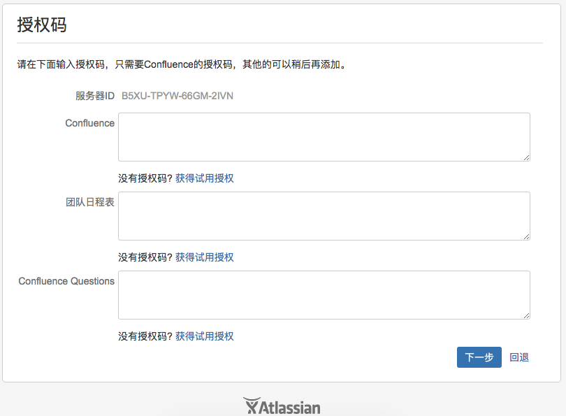
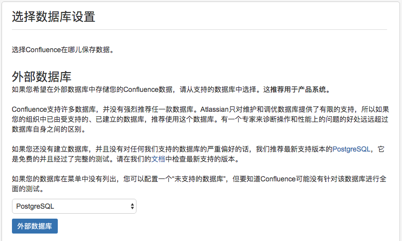

**Confluence安装与部署**

**下载安装包及破解包**

下载地址:  [云盘地址](https://pan.baidu.com/s/1a4kcbZRBgeLDTpoxb9APJg)

## 安装

- 部署准备

  confluence 是一个java 站点，部署依赖于java环境需要准备好JDK

  本次安装路径为 /application

- 开始安装

```
chmod +x atlassian-confluence-6.7.1-x64.bin

./atlassian-confluence-6.7.1-x64.bin
```

- 需要交互确认

```
Unpacking JRE ...
Starting Installer ...
五月 17, 2017 2:43:16 下午 java.util.prefs.FileSystemPreferences$1 run
信息: Created user preferences directory.

This will install Confluence 6.1.3 on your computer.
OK [o, Enter], Cancel [c]

Choose the appropriate installation or upgrade option.
Please choose one of the following:
Express Install (uses default settings) [1], 
Custom Install (recommended for advanced users) [2, Enter], 
Upgrade an existing Confluence installation [3]
1
See where Confluence will be installed and the settings that will be used.
Installation Directory: /opt/atlassian/confluence 
/application/atlassian/confluence 
Home Directory: /var/atlassian/application-data/confluence 
/application/atlassian/application-data/confluence 
HTTP Port: 8090 
RMI Port: 8000 
Install as service: Yes 
Install [i, Enter], Exit [e]
i
Extracting files ...
                                                                           

Please wait a few moments while we configure Confluence.
Installation of Confluence 6.1.3 is complete
Start Confluence now?
Yes [y, Enter], No [n]
n

Please wait a few moments while Confluence starts up.
Launching Confluence ...
Installation of Confluence 6.1.3 is complete
Your installation of Confluence 6.1.3 is now ready and can be accessed via
your browser.
Confluence 6.1.3 can be accessed at http://localhost:8090
Finishing installation ...
```

## 破解:



1. 如上图，保存获取到的服务器ID，关闭confluence:

```
/etc/init.d/confluence stop
```

2. 解压破解包，将confluence_keygen.jar 拷贝到电脑。从/opt/atlassian/confluence/confluence/WEB-INF/lib中，拷贝atlassian-extras-decoder-v2- 3.2.jar到电脑，并重命名为atlassian-extras-2.4.jar。

3. 生成License Key。

cmd 中执行:

```
java -jar confluence_keygen.jar
```

然后把上面保存的Server ID（服务器ID）粘贴进去，然后点击“.gen!”，保存生成的key。

4、打补丁。点击“.patch!”，选择第2步中重命名的atlassian-extras-2.4.jar，会生成新的atlassian-extras-2.4.jar，旧的jar包会被改为.bak。

5、上传新的atlassian-extras-2.4.jar和破解包下的Confluence-5.6.6-language-pack-zh_CN.jar、mysql-connector-java-5.1.39-bin.jar到/opt/atlassian/confluence/confluence/WEB-INF/lib，并且删除atlassian-extras-decoder-v2-3.2.jar。

6、启动confluence

```
/etc/init.d/confluence start
```

7、把生成的key复制粘贴到License Key框中，点击“Next”，如果顺利进入选择数据库页面，说明破解成功



后面就是设置连接数据库了。。。

注意，连接mysql的时候，confluence默认连接confluence库，需要提前创建好。

最终页面是这个样子:


 
