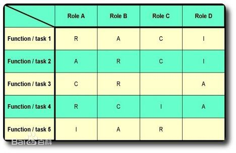
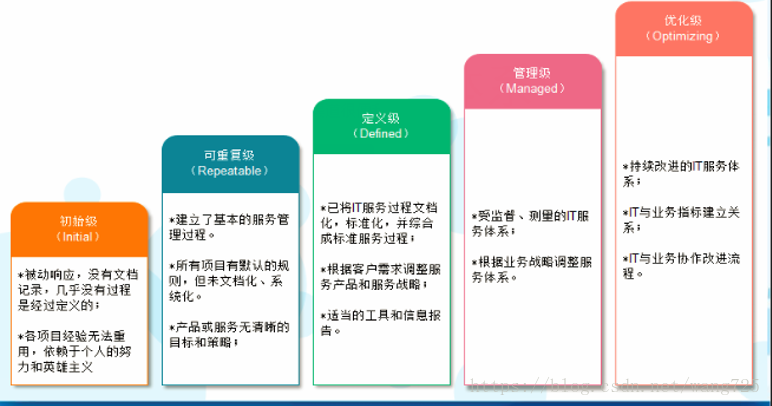

# ITIL

## 什么是服务

服务是向**客户**提供**价值**的一种**手段**，使客户不用承担特定的**成本**和**风险**就可以获得**期望的结果**。

## 服务管理

服务管理是一套特定的**组织能力**， 以**服务的形式**为**客户**提供**价值**。

## 角色

### 服务所有者：

**涉及到人员分工**，由单个或者部分人员完全掌握，指定完全的技术规范与技术标准

### 流程所有者：

**涉及到业务流程**

#### RACI模型：

- 谁负责（R = Responsible）,即负责执行任务的角色，他/她具体负责操控项目、解决问题。
- 谁批准（A = Accountable）,即对任务负全责的角色，只有经他/她同意或签署之后，项目才能得以进行。
- 咨询谁（C = Consulted）,拥有完成项目所需的信息或能力的人员。
- 通知谁 (I =Informed), 即拥有特权、应及时被通知结果的人员，却不必向他/她咨询、征求意见。

##  IT service CMM

1. 初始级 
   被动响应，没有文档记录，几乎没有过程是经过定义的； 
   各项目经验无法重用，依赖与个人的努力和英雄主义；
2. 可重复级 
   建立了基本的服务管理过程； 
   所有项目有默认的规则，但未文档化/系统化； 
   产品或服务无清晰的目标和策略；
3. 定义级 
   已将IT服务过程文档化，标准化，并综合成标准的服务过程； 
   根据客户需求调整服务产品和服务过程；
4. 管理级 
   适当的工具和信息报告；
5. 优化级 
   持续该井的IT服务体系； 
   IT与业务指标建立关联； 
   IT也业务协作改进流程；