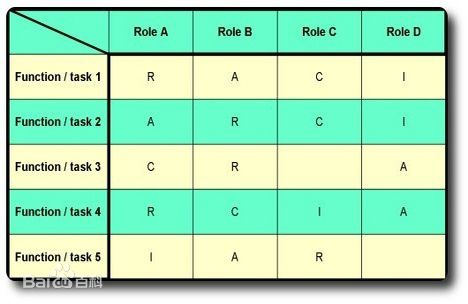

# ITIL

## 什么是服务

服务是向**客户**提供**价值**的一种**手段**，使客户不用承担特定的**成本**和**风险**就可以获得**期望的结果**。

## 服务管理

服务管理是一套特定的**组织能力**， 以**服务的形式**为**客户**提供**价值**。

## 角色

### 服务所有者：

**涉及到人员分工**，由单个或者部分人员完全掌握，指定完全的技术规范与技术标准

### 流程所有者：

**涉及到业务流程**

#### RACI模型：

- 谁负责（R = Responsible）,即负责执行任务的角色，他/她具体负责操控项目、解决问题。
- 谁批准（A = Accountable）,即对任务负全责的角色，只有经他/她同意或签署之后，项目才能得以进行。
- 咨询谁（C = Consulted）,拥有完成项目所需的信息或能力的人员。
- 通知谁 (I =Informed), 即拥有特权、应及时被通知结果的人员，却不必向他/她咨询、征求意见。

##  IT service CMM

1. 初始级 
   被动响应，没有文档记录，几乎没有过程是经过定义的； 
   各项目经验无法重用，依赖与个人的努力和英雄主义；
2. 可重复级 
   建立了基本的服务管理过程； 
   所有项目有默认的规则，但未文档化/系统化； 
   产品或服务无清晰的目标和策略；
3. 定义级 
   已将IT服务过程文档化，标准化，并综合成标准的服务过程； 
   根据客户需求调整服务产品和服务过程；
4. 管理级 
   适当的工具和信息报告；
5. 优化级 
   持续该井的IT服务体系； 
   IT与业务指标建立关联； 
   IT也业务协作改进流程；

## PDCA

​	PDCA管理方法又叫PDCA循环、质量环，是管理学中的一个通用模型，最早由[休哈特](https://www.baidu.com/s?wd=%E4%BC%91%E5%93%88%E7%89%B9&tn=SE_PcZhidaonwhc_ngpagmjz&rsv_dl=gh_pc_zhidao)（Walter A. Shewhart）于1930年构想，后来被美国质量管理专家[戴明](https://www.baidu.com/s?wd=%E6%88%B4%E6%98%8E&tn=SE_PcZhidaonwhc_ngpagmjz&rsv_dl=gh_pc_zhidao)（Edwards Deming）博士在1950年再度挖掘出来，并加以广泛宣传和运用于持续改善产品质量的过程中。它是全面质量管理所应遵循的科学程序。全面质量管理活动的全部过程，就是[质量计划](https://www.baidu.com/s?wd=%E8%B4%A8%E9%87%8F%E8%AE%A1%E5%88%92&tn=SE_PcZhidaonwhc_ngpagmjz&rsv_dl=gh_pc_zhidao)的制订和组织实现的过程，这个过程就是按照PDCA循环，不停顿地周而复始地运转的。
P、D、C、A四个英文字母所代表的意义如下： 　　

- P（Plan）——计划。包括方针和目标的确定以及活动计划的制定； 　
-  D（DO）——执行。执行就是具体运作，实现计划中的内容； 　　
-  C（Check）——检查。就是要总结执行计划的结果，分清哪些对了，哪些错了，明确效果，找出问题； 　　
- A（Action）——效果。对检查的结果进行处理，认可或否定。成功的经验要加以肯定，或着模式化或者标准化以适当推广；失败的教训要加以总结，以免重现；这一轮未解决的问题放到下一个PDCA循环。